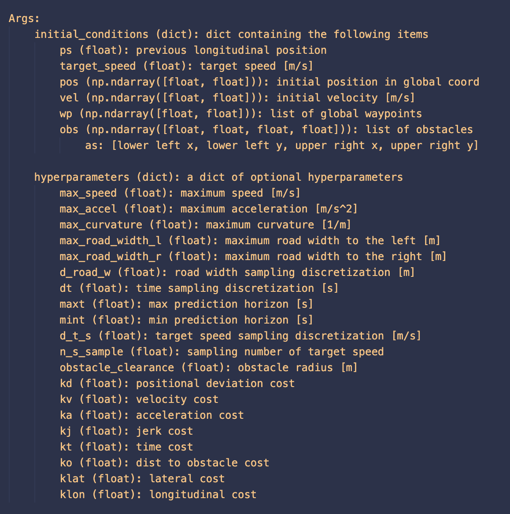
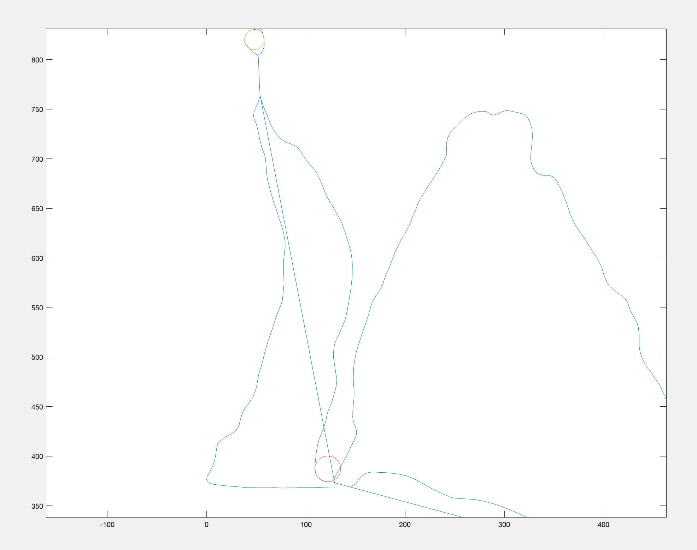

# Requirement 3
## Investigate and set Frenet Frame initial conditions and hyperparameters

To satisfy this requirement, I found descriptions of the initial conditions and hyperparameters used in the frenet-optimal-trajectory repo we're utilizing for path planning:

Hyperparameters are constant values that will hold throughout the entire process while initial conditions get updated with each iteration of the control loop.

I set the values for the initial conditions as follows:
 - c

I set the values for the hyperparameters as follows:
 - max_speed: 4 m/s ([source](https://docs.aws.amazon.com/deepracer/latest/developerguide/deepracer-how-it-works-action-space.html))
 - max_accel: 3 m/s^2 (estimate from measurements Alex and I took with the IMU)
 - max_curvature: 0.1 (estimated by plotting circles on the tightest turns of the golf course - see below)
 - max_road_width_l/r: 1.25 m (Golf cart paths are typically 7 - 14 feet wide. This may be easily checked by manually measuring path width at LCC)
 - d_road_w: 0.25 (This precision should be sufficient for navigating within a 2.5-meter wide cart path)
 - dt: 0.1 (This should be more than sufficient to provide a precise path for the controller)
 - maxt: 2.0 (Derived from the idea that we should never need to know the path any farther out than 2 seconds)
 - mint: 0.1 (Estimate of the time it takes for 1. the path to be generated and sent to the controller and 2. the commands from the controller to reach the car. Because of WiFi latency this should be around 0.1 seconds)
 - d_t_s: 0.1 (Guess based on the repo having a d_t_s of 0.5 for a max_speed of 10)
 - n_m_s: 2.0 (Unchanged from original repo value)
 - obstacle_clearance: 0.1 (Estimate based on the DeepRacer's dimensions)
 - kd: 1.0 (Unchanged from original repo value)
 - kv: 0.1 (Unchanged from original repo value)
 - ka: 0.1 (Unchanged from original repo value)
 - kj: 0.1 (Unchanged from original repo value)
 - kt: 0.1 (Unchanged from original repo value)
 - ko: 0.1 (Unchanged from original repo value)
 - klat: 1.0 (Unchanged from original repo value)
 - klon: 1.0 (Unchanged from original repo value)

A plot of Lawrence Country Club. I plotted circles (seen in the upper and lower portions of the graph) to estimate the maximum curvature (the place where a circle with the smallest radius may be plotted).