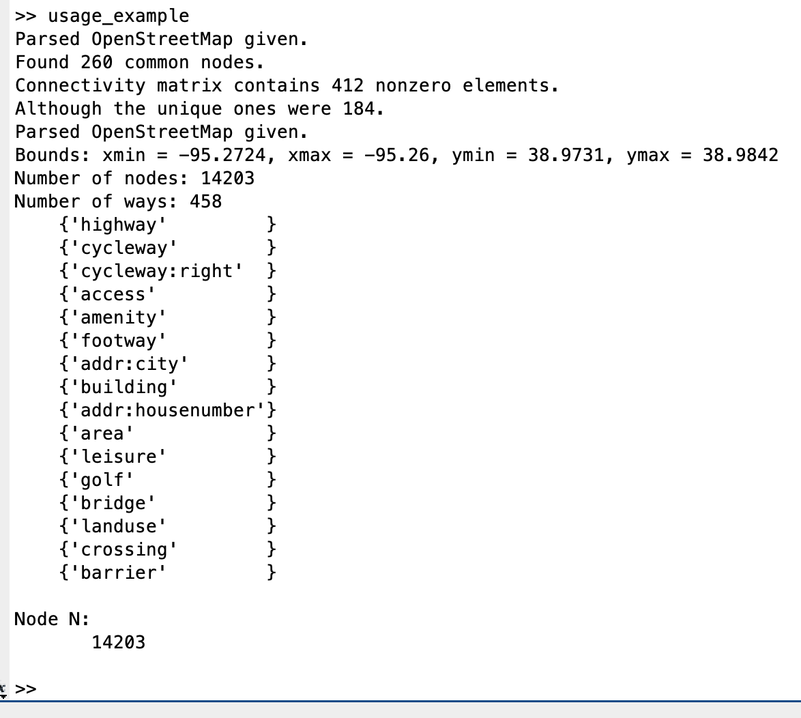
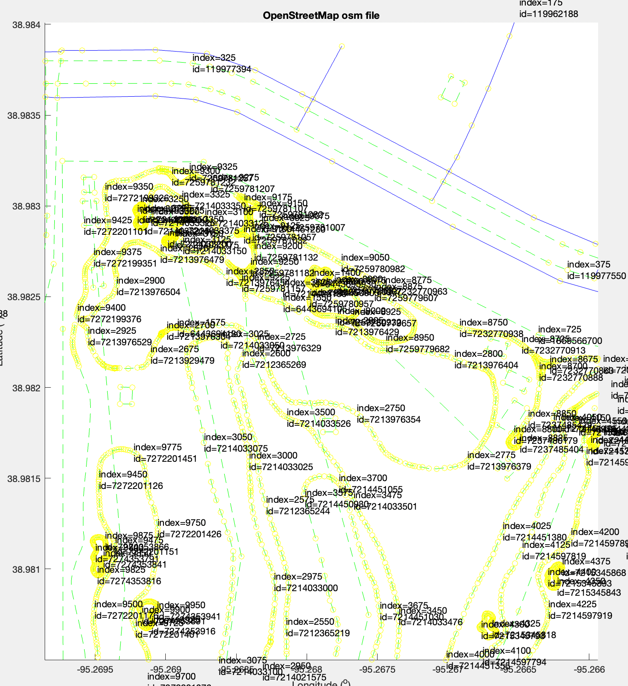
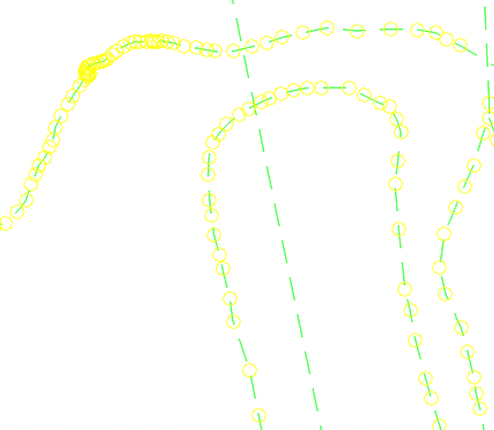

Using a MATLAB package called [OpenStreetMap Functions](https://www.mathworks.com/matlabcentral/fileexchange/35819-openstreetmap-functions), I was able to interact with the OSM map of Lawrence Country Club.

Using this software package, I was able to parse and interact with the map, including access to information about individual nodes and ways.
This will allow us to start implementing route planning.

The MATLAB code is found in the MatLab_OSM directory included in the directory this .txt file is in.
I primarily used the usage_example.m script to run my preliminary tests.

Below are some screenshots showing off the functionality of this MATLAB package.

  
This image shows some of the information outputted to the console during the processing of the usage_example script

  
This image is a screenshot of the map with ID and index annotations over the nodes (represented as yellow circles). Note that annotations are only displayed on 1 out of every 25 nodes to avoid clutter.

  
This image is a screenshot of the map's ways next to a satellite image of the same location.

  
This image is a screenshot of a map the difference in node density along ways on golf course map. The route in the top part of the image has high node density while the route on the lower part of the image has low node density.
We will need to keep in mind how this might affect route planning. We may need to interpolate new nodes along paths with low node density or ignore nodes if they overlap too much in high density areas.