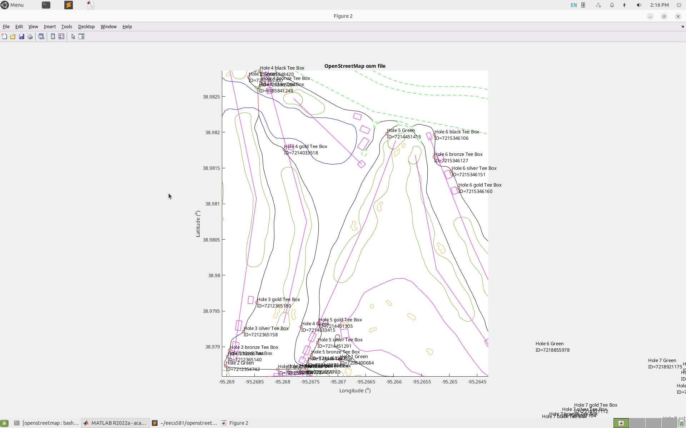

I determined that the significant locations I'd mark would be the black, bronze, silver, and golf tee boxes for the first 9 holes at Lawrence Country Club as well as the greens where the actual hole is located. This will give us a good start and end waypoint for each hole as well as the option for users to select between the 4 different tee boxes available at each hole.

The main code which completes this functionality can be found [here](https://github.com/cskroonenberg/openstreetmap/blob/main/sig_loc.m).

      The above screenshot shows a portion of the golf course as well as the nodes (marked in red, with descriptive annotations).

