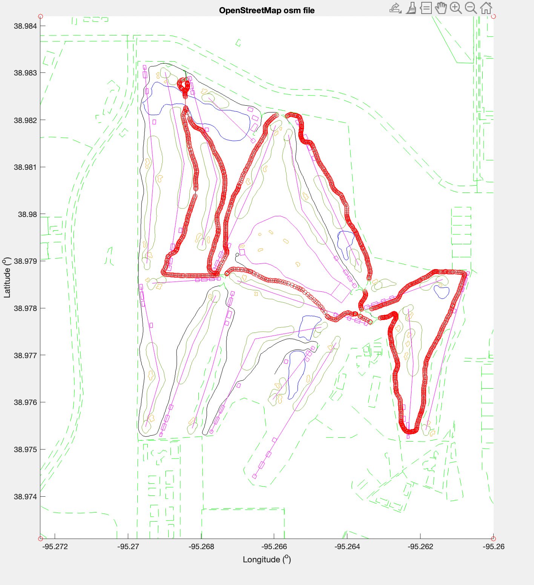
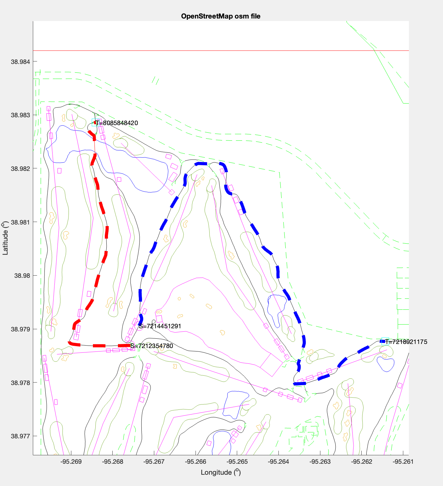

This requirement ended up being a lot more intensive than originally planned. The MATLAB library I've been working with did not end up working as I thought it would, so I had to integrate a new map representation and manually integrate the route planning procedures

The MATLAB library I've been working with implemented the graph as an adjacency matrix, which certainly has it's downsides as it's space complexity is $O(|V|^2)$. Our graph has over 14k nodes, so I decided to implement the graph as an adjacency list which has space complexity of $O(|V| + |E|)$. Lookup time is practically comparable between both implementations because most nodes in our graph have a degree of 1. 

The graph is a directed graph with edge weights corresponding to the straight line distance between nodes (according to their latitude and longitude) and the edge directions corresponding to the direction of the cartpath.

The code which implements the construction of the adjacency list be found [here](https://github.com/cskroonenberg/openstreetmap/blob/main/extract_adjacency_list.m). <br>

This representation allows us to do things like traverse the graph. To check that the connectivity of the graph was working as intended after constructing the adjacency list, I implemented a Depth-First Search traversal of the graph starting at the node where we'd start golfing from. The code which does the DFS traversal can be found [here](https://github.com/cskroonenberg/openstreetmap/blob/main/connected_nds.m).

 The above screenshot shows all nodes reachable from the start node. It was generated by plotting the nodes returned from the connected_nds function (linked previously).

With this graph, we can plan routes from a source node S to a destination node T using Dijkstra's algorithm. The code which implements Dijkstra's algorithm can be found [here](https://github.com/cskroonenberg/openstreetmap/blob/main/find_route.m). It returns the ordered array of nodes which must be taken from S to get to T.

 The above screenshot shows a red route from hole 2's black teebox to hole 4's black teebox and a blue route from hole 5's silver teebox to hole 7's green. Below is a code snippet showing the function calls made to calculate the routes:

```
adjacency_list = extract_adjacency_list(parsed_osm);

S = nd_id_2_idx(sig_loc(2, 'black'), parsed_osm.node);
T = nd_id_2_idx(sig_loc(4, 'black'), parsed_osm.node);

route1 = find_route(S, T, adjacency_list);

S = nd_id_2_idx(sig_loc(5, 'silver'), parsed_osm.node);
T = nd_id_2_idx(sig_loc(7, 'hole'), parsed_osm.node);

route2 = find_route(S, T, adjacency_list);
```