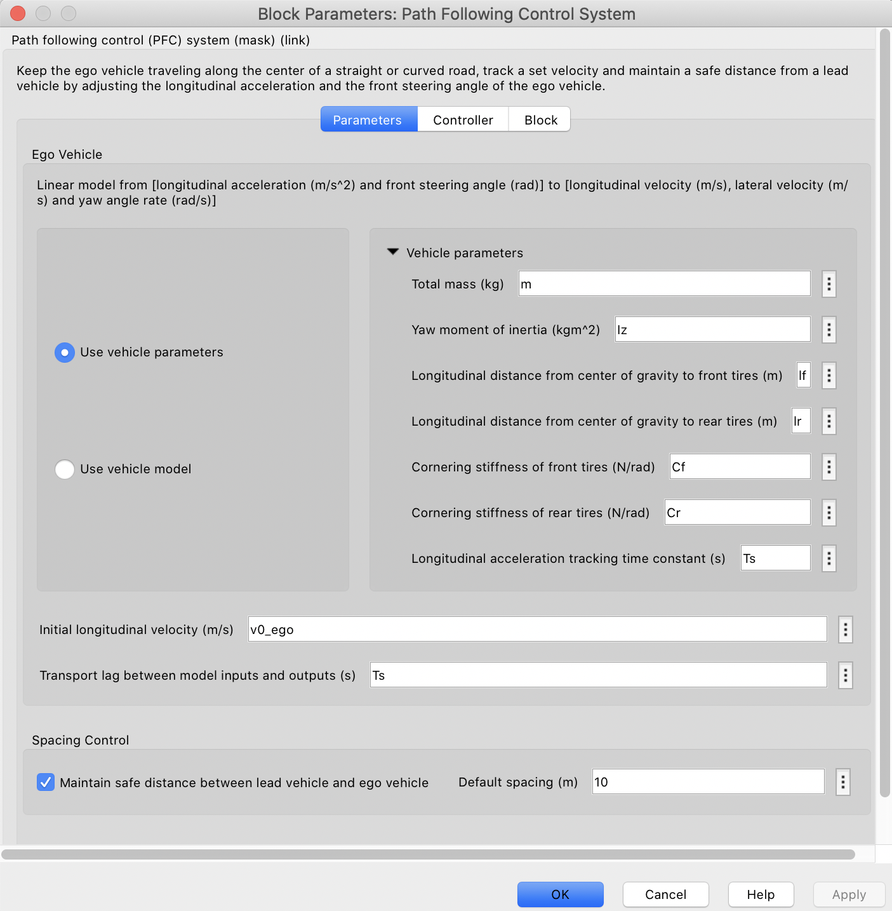
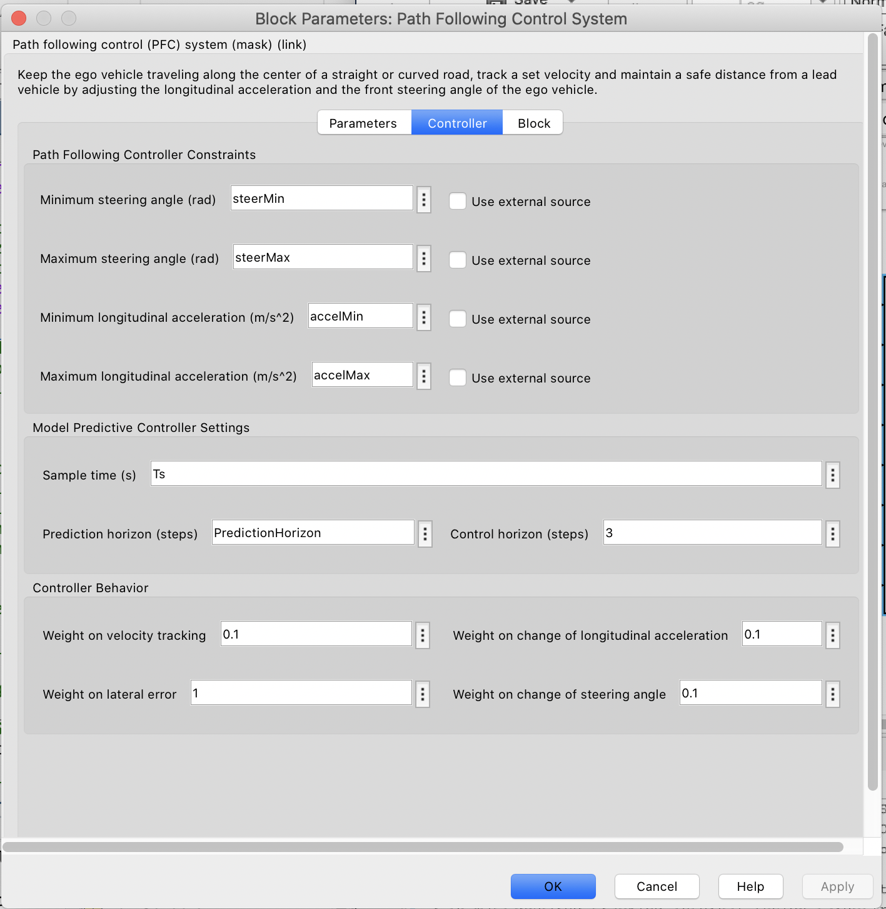

We consider the planning algorithm for the lane keeping problem in a golf cart. The vehicle parameters are estimated as inputs to a linear state-space model, which the controller uses to perform adaptive cruise control and lane-keeping.

Constraints are identified as the physical constraints on the golf cart's actuators.

The controller is implemented in MATLAB Simulink:

