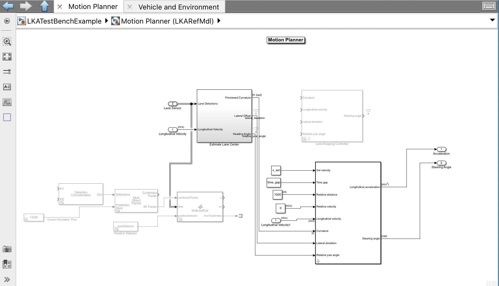

Due to time constraints, we couldn't complete this task.

We defined a scenario with an obstacle using matlab Scenario designer. Then we designed the motion planner subsystem to take inputs from the radar and camera to detect obstacles:

But due to technical issues couldn't achieve the full functionality. However, we successfully achieved lane keeping.

Code:
https://github.com/KU-EECS-581-Self-Driving-Golfcart/cdPlan
