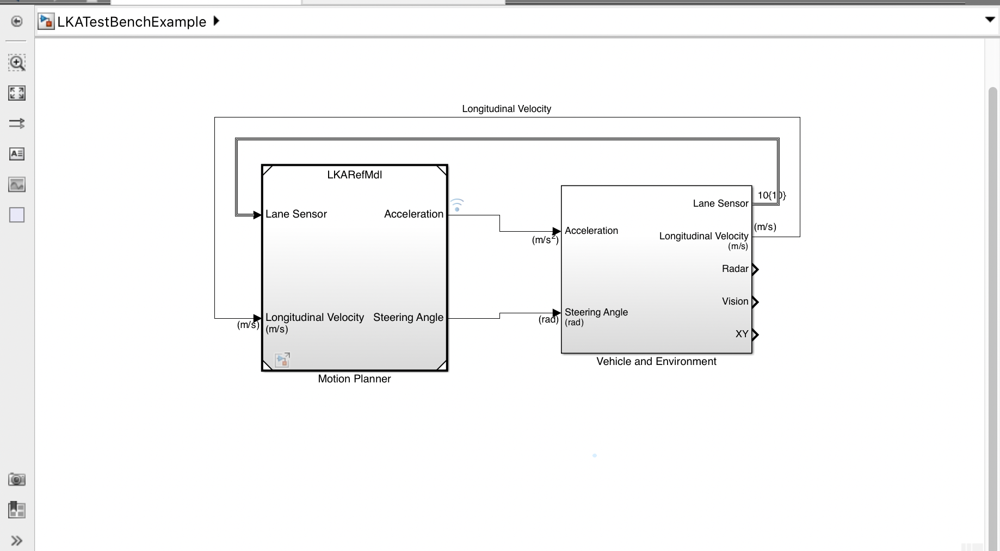

We created a simulink model to test the motion planner in a variety of scenarios. The model parameters were the physical parameters of the golf cart (see helperLFSetup.m).

The model was

Please see the matlab code and simulink blocks for high detail.