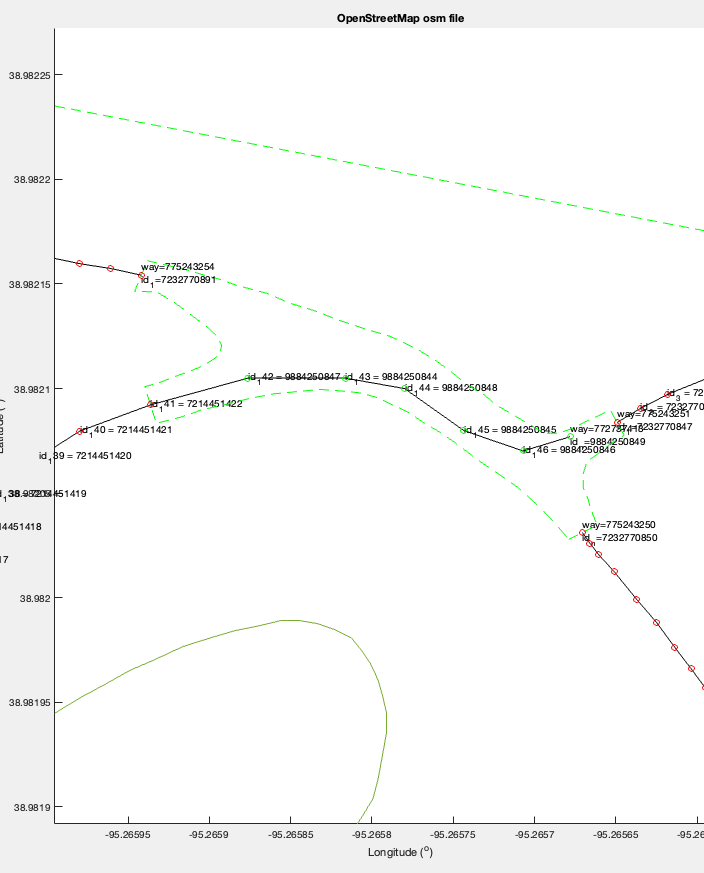
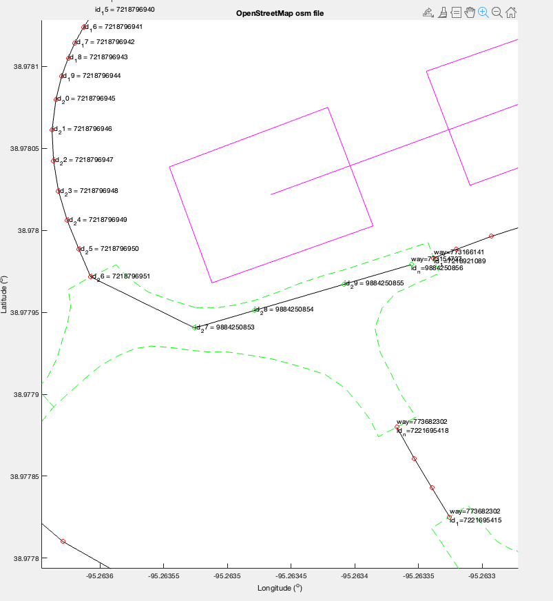
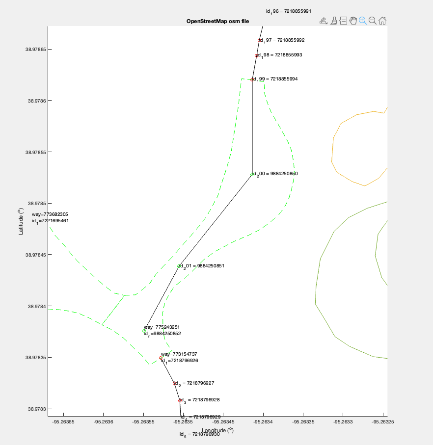
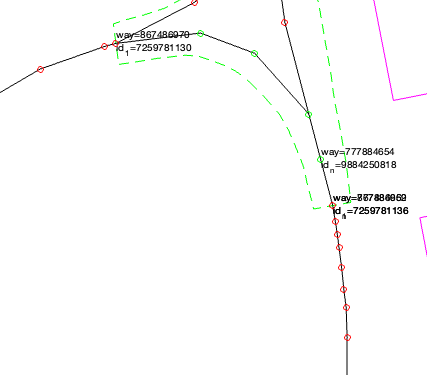
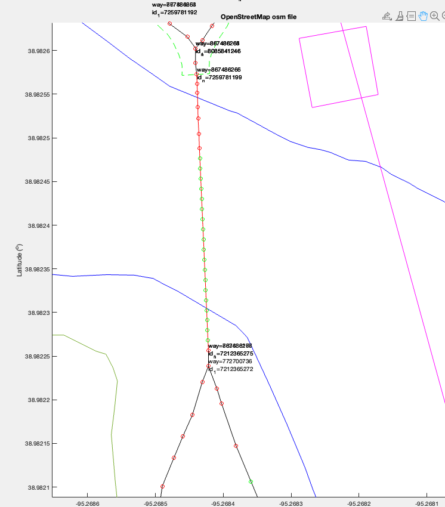

# Req 3
This requirement was to add nodes to the map to fill in gaps between ways or large gaps between nodes.

To do this, I added functionality to calculate the longitude and latitude values between two nodes based on proportional values (for example, I may want to use 80% of node A's latitude and 20% of node B's latitude as well as 50% of node A's longitude and 50% of node B's longitude for the position for the new node). I then added calculated a new node ID that hasn't been used yet and inserted the value into the data structure containing the nodes as well as into the list of nodes contained in whichever way the node was being inserted into.

This whole process was a lot of guessing and checking what weighted averages of latitude and longitude would work to add nodes in beneficial locations.

In the following screenshots, red nodes were established beforehand, and green nodes are nodes I added to provide a more precise representation of the area.

