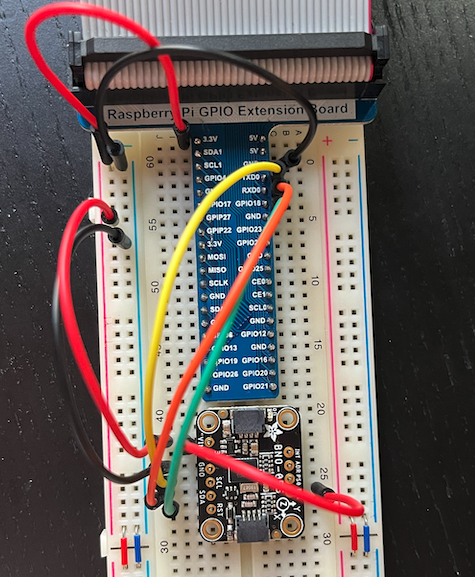

# Req 8
I was able to read in data from the IMU by connecting it to a Raspberry Pi with the help of a breadboard. The code (from the manufacturer) can be found [here](https://github.com/adafruit/Adafruit_BNO055/tree/master/examples). I used these resources to for reference along the way:
- Software setup ([link](https://learn.adafruit.com/bno055-absolute-orientation-sensor-with-raspberry-pi-and-beaglebone-black/software))
- Hardware setup ([link](https://learn.adafruit.com/bno055-absolute-orientation-sensor-with-raspberry-pi-and-beaglebone-black/hardware#raspberry-pi))

IMU connected to the Raspberry Pi via breadboard:

IMU output in the terminal:
