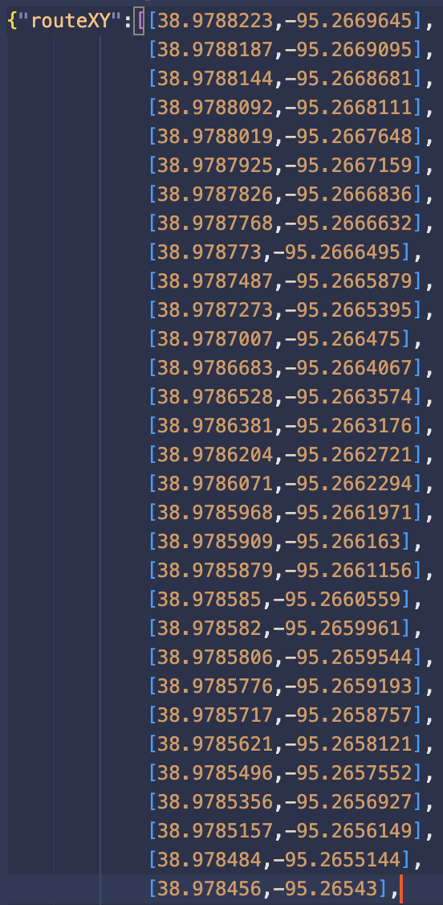

# Requirement 3
## Convert MATLAB route to JSON format

In order to display the current routeon the UI, we will be writing the route to a JSON file which can be read by the UI's JavaScript. Using the arr_2_json MATLAB function [here](https://github.com/cskroonenberg/openstreetmap/blob/main/arr_2_json.m), I can export the route's GPS coordinates to a JSON file easily:

```matlab
...
route_xy = nodes.xy(:, route);
arr_2_json(flip(transpose(flip(route_xy))), 'routeXY', 'routeXY.json');
```

This code takes the coordinates of each node in a route and dumps the information into a JSON file, ```routeXY.json```:

