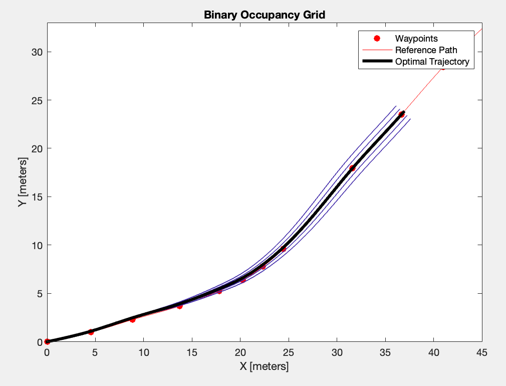

# Requirement 4
## Implement Fernet Frame path generator

Using MATLAB's [trajectoryOptimalFrenet](https://www.mathworks.com/help/nav/ref/trajectoryoptimalfrenet.html) object, we can generate an optimal trajectory based on a handful of parameters. The object takes a reference path given by the waypoints in our route, the vehicles velocity, acceleration, and orientation as well as a [binaryOccupancyMap](https://www.mathworks.com/help/nav/ref/binaryoccupancymap.html) object and creates a handful of plausible routes before narrowing down which of those is optimal.

My implementation can be found [here](https://github.com/cskroonenberg/openstreetmap/blob/main/path_planner.m). Further work on this module will include updating the binary occupancy map and vehicle's position, acceleration, velocity in real time.

